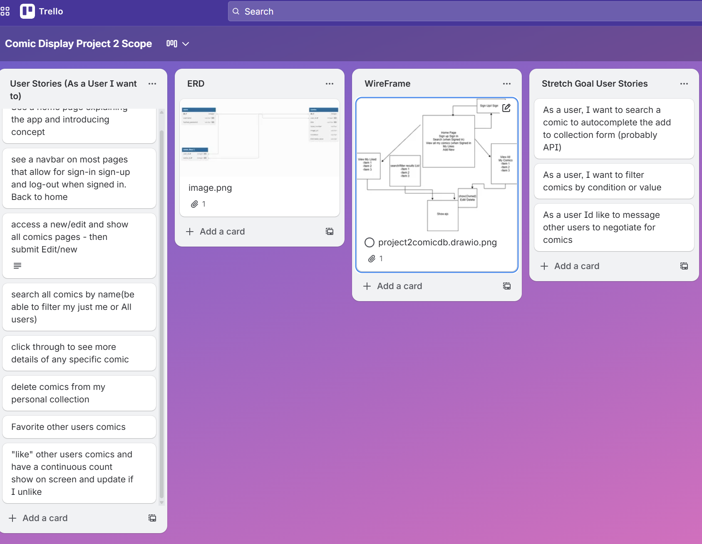

# Comic Display

## Screenshot / Logo

---

## App Name & Description
**Comic Display** is a web application that allows users to upload, browse, and manage digital representations of their **physical comic book collections**. Users can add comics with cover images, search comics by title, filter by date, and view **their own comics** or **comics they have liked**. This means you can share your collection digitally without having to post it for sale.

The app functions as a **digital display collection** for real-world comic books (or your fantasy collection?), allowing collectors to showcase their collections without repeatedly handling, organizing and sorting physical items anywhere in the world from the cloud.

---

## Getting Started

### Deployed App
**Live App:**  
(https://comics-display-ffac901f9b1a.herokuapp.com/)

### Planning Materials
- **ERD:** dbdiagram.io
- **Wireframes:** diagrams.net
- **Trello Project Board / Notes:** 

---

## Attributions

- **Fonts:** [Google Fonts - Nunito](https://fonts.google.com/specimen/Nunito)
- **Logo Design:** Custom created for Comics Display by ChatGPT 2026
- **Favicon:** Custom created icon.png by ChatGPT 2026
- **Development Guidance:** Built with support from General Assembly curriculum, ChatGPT, freecodecamp assets, MIMO, Codecademy and Claude AI assistant

---

## Technologies Used

### Core Technologies
- **JavaScript** (ES6+)
- **HTML5**
- **CSS3**
- **Node.js** (v18+)
- **Express.js** (Web framework)
- **MongoDB** (NoSQL Database)
- **Mongoose** (MongoDB ODM)

### Authentication & Session Management
- **bcrypt** (Password hashing)
- **express-session** (Session management)
- **connect-mongo** (MongoDB session store)

### Middleware & Utilities
- **method-override** (HTTP verb support for forms)
- **morgan** (HTTP request logger)
- **dotenv** (Environment variable management)
- **EJS** (Embedded JavaScript templating)

### Planning & Design Tools
- **dbdiagram.io** (ERD design)
- **diagrams.net** (Wireframes)
- **Trello** (Project management & planning)

---

## Next Steps (Planned Enhancements)
- Allow **image uploads** in addition to image links
- Add **advanced filtering** (condition, series, year, publisher)
- Support **multiple images per comic** (variants, interior pages)
- Implement **user profiles** with bio and collection stats
- Add **marketplace buy/sell features**
- Enable **comic series tracking** and wishlist functionality beyond current "Favorite" system
- Implement **social features** (comments, ratings, collection sharing)

---

## Presentation Requirements
- Demonstrate **login and singup functions**
- Demonstrate **searching comics by title**
- Demonstrate **viewing "My Comics"**
- Demonstrate **liking a comic** and viewing liked comics
- Explain how **user ownership** prevents editing/deleting other users' comics
- Walk through the **ERD** and explain table relationships

## Database Structure (ERD)

The application uses a three-table relational database structure:

**Users Table:**
- Stores user authentication credentials (username, hashed_password)
- Each user has a unique ID that serves as the primary key

**Comics Table:**
- Contains all comic book details (title, issue_number, image_url, condition, estimated_value)
- Each comic is linked to its owner via the `user_id` foreign key
- One user can own many comics (one-to-many relationship)

**Comic_Likes Table (Junction Table):**
- Creates a many-to-many relationship between users and comics
- Allows users to favorite comics they don't own
- Tracks which users have favorited which comics
- Each row represents one user favoriting one comic

This structure enables users to manage their own collections while also discovering and favoriting comics from other community members.